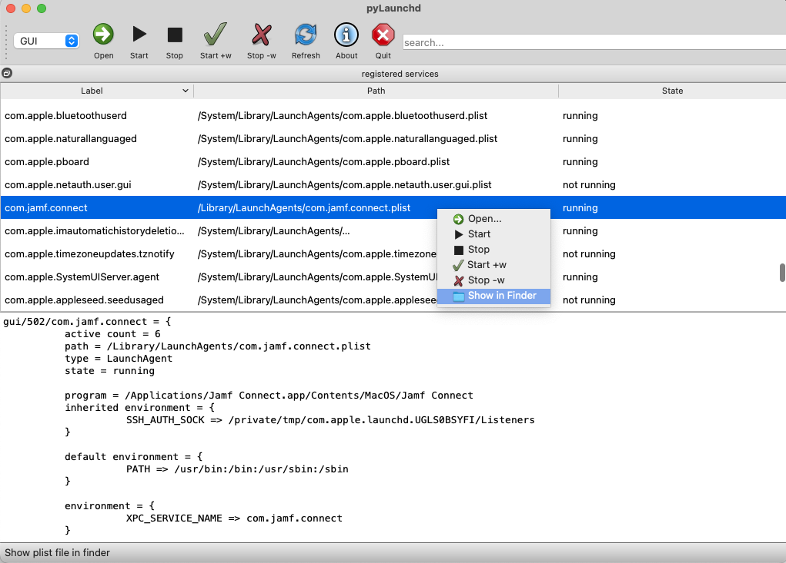

# pylaunchd
MacOS launchd/launchctl GUI

- view macos launchagents and launchdaemons user/system/gui and properties
- edit with user configurable editor (recommended for binary `.plist` files: TextMate or SublimeText with binary plist package installed) 
- start/stop/enable/disable jobs (WIP) 

#### Other launchd GUI apps

- [Lingon X](https://www.peterborgapps.com/lingon/)
- [LaunchControl](https://www.soma-zone.com/LaunchControl/)
